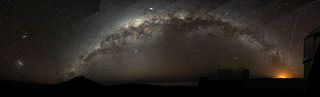
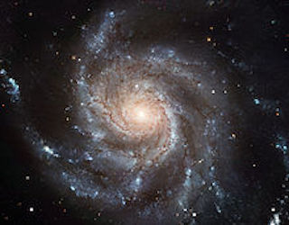
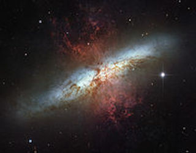

- [Galaxy](galaxy.html)
- [Shakespeare](shakespeare.html)

# Galaxy

Astronomical Structure of a Galaxy

## About Galaxies

A galaxy is a gravitationally bound system of stars, stellar remnants,
interstellar gas, dust, and dark matter. The word galaxy is derived from
the Greek galaxias (γαλαξίας), literally "milky", a reference to the
Milky Way. Galaxies range in size from dwarfs with just a few hundred
million (108) stars to giants with one hundred trillion (1014) stars,
each orbiting its galaxy's center of mass.

Galaxies are categorized according to their visual morphology as
elliptical,[4] spiral, or irregular. Many galaxies are thought to have
supermassive black holes at their centers. The Milky Way's central black
hole, known as Sagittarius A, has a mass four million times greater
than the Sun. As of March 2016, GN-z11 is the oldest and most distant
observed galaxy with a comoving distance of 32 billion light-years from
Earth, and observed as it existed just 400 million years after the Big
Bang.

Research released in 2016 revised the number of galaxies in the
observable universe from a previous estimate of 200 billion (2×1011) to
a suggested 2 trillion (2×1012) or more, containing more stars than all
the grains of sand on planet Earth. Most of the galaxies are 1,000 to
100,000 parsecs in diameter (approximately 3000 to 300,000 light years)
and separated by distances on the order of millions of parsecs (or
megaparsecs). For comparison, the Milky Way has a diameter of at least
30,000 parsecs (100,000 LY) and is separated from the Andromeda Galaxy,
its nearest large neighbor, by 780,000 parsecs (2.5 million LY).

The space between galaxies is filled with a tenuous gas (the
intergalactic medium) having an average density of less than one atom
per cubic meter. The majority of galaxies are gravitationally organized
into groups, clusters, and superclusters. The Milky Way is part of the
Local Group, which is dominated by it and the Andromeda Galaxy and is
part of the Virgo Supercluster. At the largest scale, these associations
are generally arranged into sheets and filaments surrounded by immense
voids. The largest structure of galaxies yet recognized is a cluster of
superclusters that has been named Laniakea, which contains the Virgo
supercluster.

## Milky Way

The Greek philosopher Democritus (450–370 BCE) proposed that the bright
band on the night sky known as the Milky Way might consist of distant
stars. Aristotle (384–322 BCE), however, believed the Milky Way to be
caused by "the ignition of the fiery exhalation of some stars that were
large, numerous and close together" and that the "ignition takes place
in the upper part of the atmosphere, in the region of the World that is
continuous with the heavenly motions." The Neoplatonist philosopher
Olympiodorus the Younger (c. 495–570 CE) was critical of this view,
arguing that if the Milky Way is sublunary (situated between Earth and
the Moon) it should appear different at different times and places on
Earth, and that it should have parallax, which it does not. In his view,
the Milky Way is celestial.

According to Mohani Mohamed, the Arabian astronomer Alhazen (965–1037)
made the first attempt at observing and measuring the Milky Way's
parallax, and he thus "determined that because the Milky Way had no
parallax, it must be remote from the Earth, not belonging to the
atmosphere." The Persian astronomer al-Bīrūnī (973–1048) proposed the
Milky Way galaxy to be "a collection of countless fragments of the
nature of nebulous stars." The Andalusian astronomer Ibn Bâjjah
("Avempace", d. 1138) proposed that the Milky Way is made up of many
stars that almost touch one another and appear to be a continuous image
due to the effect of refraction from sublunary material, citing his
observation of the conjunction of Jupiter and Mars as evidence of this
occurring when two objects are near. In the 14th century, the
Syrian-born Ibn Qayyim proposed the Milky Way galaxy to be "a myriad of
tiny stars packed together in the sphere of the fixed stars."

Actual proof of the Milky Way consisting of many stars came in 1610 when
the Italian astronomer Galileo Galilei used a telescope to study the
Milky Way and discovered that it is composed of a huge number of faint
stars. In 1750 the English astronomer Thomas Wright, in his An original
theory or new hypothesis of the Universe, speculated (correctly) that
the galaxy might be a rotating body of a huge number of stars held
together by gravitational forces, akin to the Solar System but on a much
larger scale. The resulting disk of stars can be seen as a band on the
sky from our perspective inside the disk. In a treatise in 1755,
Immanuel Kant elaborated on Wright's idea about the structure of the
Milky Way.

The first project to describe the shape of the Milky Way and the
position of the Sun was undertaken by William Herschel in 1785 by
counting the number of stars in different regions of the sky. He
produced a diagram of the shape of the galaxy with the Solar System close to the center. Using a refined approach, Kapteyn in 1920 arrived at the picture of a small (diameter about 15 kiloparsecs) ellipsoid galaxy with the Sun close to the center. A different method by Harlow Shapley based on the cataloguing of globular clusters led to a radically different picture: a flat disk with diameter approximately 70 kiloparsecs and the Sun far from the center. Both analyses failed to take into account the absorption of light by interstellar dust present in the galactic plane, but after Robert Julius Trumpler quantified this effect in 1930 by studying open clusters, the present picture of our host galaxy, the Milky Way, emerged.

## Spirals

Spiral galaxies resemble spiraling pinwheels. Though the stars and other visible material contained in such a galaxy lie mostly on a plane, the majority of mass in spiral galaxies exists in a roughly spherical halo of dark matter that extends beyond the visible component, as demonstrated by the universal rotation curve concept. 
Spiral galaxies consist of a rotating disk of stars and interstellar medium, along with a central bulge of generally older stars. Extending outward from the bulge are relatively bright arms. In the Hubble classification scheme, spiral galaxies are listed as type S, followed by a letter (a, b, or c) that indicates the degree of tightness of the spiral arms and the size of the central bulge. An Sa galaxy has tightly wound, poorly defined arms and possesses a relatively large core region. At the other extreme, an Sc galaxy has open, well-defined arms and a small core region. A galaxy with poorly defined arms is sometimes referred to as a flocculent spiral galaxy; in contrast to the grand design spiral galaxy that has prominent and well-defined spiral arms. The speed in which a galaxy rotates is thought to correlate with the flatness of the disc as some spiral galaxies have thick bulges, while others are thin and dense.
In spiral galaxies, the spiral arms do have the shape of approximate logarithmic spirals, a pattern that can be theoretically shown to result from a disturbance in a uniformly rotating mass of stars. Like the stars, the spiral arms rotate around the center, but they do so with constant angular velocity. The spiral arms are thought to be areas of high-density matter, or "density waves". As stars move through an arm, the space velocity of each stellar system is modified by the gravitational force of the higher density. (The velocity returns to normal after the stars depart on the other side of the arm.) This effect is akin to a "wave" of slowdowns moving along a highway full of moving cars. The arms are visible because the high density facilitates star formation, and therefore they harbor many bright and young stars.

## Starburst

Stars are created within galaxies from a reserve of cold gas that forms into giant molecular clouds. Some galaxies have been observed to form stars at an exceptional rate, which is known as a starburst. If they continue to do so, then they would consume their reserve of gas in a time span less than the lifespan of the galaxy. Hence starburst activity usually lasts for only about ten million years, a relatively brief period in the history of a galaxy. Starburst galaxies were more common during the early history of the Universe, and, at present, still contribute an estimated 15% to the total star production rate.
Starburst galaxies are characterized by dusty concentrations of gas and the appearance of newly formed stars, including massive stars that ionize the surrounding clouds to create H II regions. These massive stars produce supernova explosions, resulting in expanding remnants that interact powerfully with the surrounding gas. These outbursts trigger a chain reaction of star building that spreads throughout the gaseous region. Only when the available gas is nearly consumed or dispersed does the starburst activity end.
Starbursts are often associated with merging or interacting galaxies. The prototype example of such a starburst-forming interaction is M82, which experienced a close encounter with the larger M81. Irregular galaxies often exhibit spaced knots of starburst activity.

## Lists

### Other Types of Galaxies

- Interacting
- Active Galaxy
- Quasar
- Seyfert Galaxy
- Liners
- Blazers
- Luminous infrared galaxy

### List of Nearest Galaxies 

1. Canis Major Dwarf
2. Segure 1
3. Sagittarius Dark Sphere
4. Ursa Major II Dwarf
5. Reticulum II Dwarf
6. Triangulum II
7. Segue 2

## References

- ["This Galaxy Far, Far Away is the Farthest One yet"](https://www.space.com/29319-farthest-galaxy-ever-found.html).Retrieved 2015-05-17
- Hupp, E.; Roy, S.; Watzke, M. (August 12 2006). ["NASA Finds Direct Proof of Dark Matter"](https://www.nasa.gov/home/hqnews/2006/aug/HQ_06297_CHANDRA_Dark_Matter.html).NASA.Retrieved April 17, 2007.
- Finley, D.; Aguilar, D. (November 2, 2005).[“Astronomers Get Closest Look Yet At Milky Way’s Mysterious Core”](https://www.nrao.edu/pr/2005/sagastar/).National Radio Astronomy Obervatory.Retrieved August 10, 2006.
- [Galaxy wikipedia page](https://en.wikipedia.org/wiki/Galaxy)
- [Milky Way Galaxy wikipedia page](https://en.wikipedia.org/wiki/Milky_Way)
- [Lists of nearest galaxies wikipedia page](https://en.wikipedia.org/wiki/List_of_nearest_galaxies)
